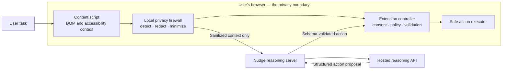
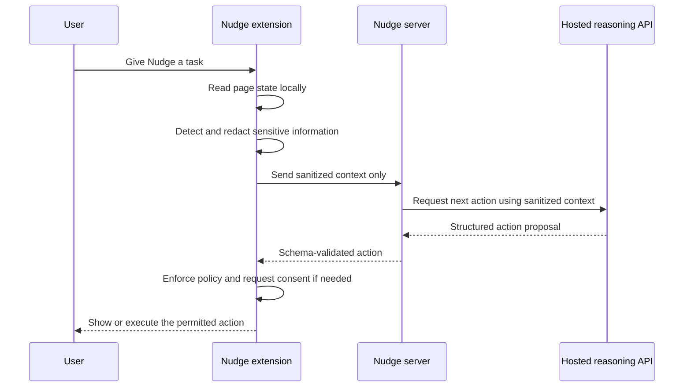

<h1 align="center" style="border-bottom: none;">Nudge <sub>by  Heddle</sub></h1>

<h3 align="center">Privacy is enforced before intelligence is invoked.</h3>

<p align="center"><strong>Nudge is a local-first browser agent that helps people complete web workflows without handing their private screen, form data, or credentials to an AI provider.</strong></p>

---

Nudge is built by **Heddle**, in public. [Smart India Hackathon 2026 problem statement SIH26171](problem-statement.md), *On-device Visual Perception for Light-weight Browser Agents*, gave us a precise challenge—but it is not the reason Nudge exists.

We see a genuine and growing problem: people should be able to benefit from capable browser agents without being forced to expose their screens, forms, credentials, and personal workflows to an AI provider. Nudge is being built as an open project to make that privacy-respecting path practical, inspectable, and useful beyond the hackathon.

Most browser agents begin by sending a page or screenshot to an AI model. Nudge begins with a different question: **what must never leave the browser?** It sanitizes context on the user’s device, then asks a hosted reasoning service to propose a safe, structured next action.

**Status:** Local privacy firewall, schema-enforced hosted reasoning, confirmed safe actions, and controlled SIH demo flow complete

---

## The idea in one minute

Nudge helps with multi-step browser workflows—such as tracking an application, navigating a service portal, or completing a routine request—while preserving the user’s privacy boundary.

It can understand the visible interface, identify buttons and form fields, and plan the next step. Before reasoning happens, the extension locally masks sensitive values such as passwords, IDs, email addresses, phone numbers, account details, and user-designated private content.

The reasoning service never receives the original page context. It receives a deliberately minimized, sanitized representation and may return only constrained actions such as `click`, `scroll`, `select`, or `request_user_input`.



## Why Nudge

| The usual agent trade-off | Nudge’s position |
| --- | --- |
| A model needs page context to reason | Give it only the minimum safe context |
| Automation can be opaque | Show the proposed action and why it is needed |
| An LLM response can be unsafe or stale | The extension treats it as a proposal, never an authority |
| Browser data may contain private information | Redact locally before the first network request |
| Powerful agents can surprise users | Use consent modes, action policies, and an audit trail |

Nudge’s core differentiator is not merely browser automation. It is a **privacy firewall built into the automation loop**.

## Design principles

### Local-first privacy

Sensitive information is detected and sanitized inside the browser. Raw DOM snapshots, original screenshots, passwords, cookies, browser storage, tokens, and unredacted form values are not part of the server contract.

### Intelligence is useful, not trusted

Nudge can use hosted reasoning APIs without requiring an LLM to run on the user’s machine. The external model can recommend a next action, but it cannot execute code, access browser internals, or bypass extension policy.

### Structure before pixels

The extension starts with the DOM and accessibility tree because they are lightweight, precise, and explainable. Local visual context supplements this for interfaces where structure alone is not enough.

### Human control by default

Nudge supports three modes: **Suggest**, **Confirm**, and **Trusted Flow**. The demonstrator defaults to Confirm mode. Irreversible, financial, security-sensitive, CAPTCHA, MFA, or unexpected navigation steps always pause for the user.

## What happens to data



Examples of information that stays local:

- Passwords, OTPs, authentication data, cookies, and tokens
- Government IDs, account and card numbers
- Email addresses, phone numbers, addresses, and dates of birth
- Values inside sensitive form fields
- Original screenshots and unredacted visual regions

The browser sends semantic placeholders where useful—for example, `[EMAIL_REDACTED]` or `[ID_REDACTED]`—so the model can still reason about the interface without seeing the underlying value.

## Architecture

| Layer | Runs where | Responsibility |
| --- | --- | --- |
| Extension UI | Browser | Task input, consent controls, redaction preview, audit timeline |
| Content script | Browser tab | Create a local inventory of permitted DOM/a11y context; execute approved actions |
| Privacy and perception engine | Browser | Detect sensitive elements; redact and minimize context before network use |
| Extension controller | Browser | Coordinate state, enforce policy, validate all server responses |
| Nudge reasoning server | Heddle backend | Orchestrate a hosted model, validate schemas, return safe next-action proposals |
| Hosted reasoning API | External provider | Reason only over Nudge’s sanitized context |

### The extension is the authority

The Nudge server and model provider never directly control the browser. Every action is checked locally against the current page state and Nudge’s policy before it can be proposed or executed.

```text
Model response → server schema validation → extension policy validation → user consent when required → browser action
```

## Safe action contract

Nudge exchanges structured data, not arbitrary scripts. A model never returns JavaScript, a shell command, or a free-form instruction for the browser to execute.

```json
{
  "action": {
    "type": "click",
    "targetId": "el_8e42"
  },
  "rationale": "This opens the application tracking flow.",
  "confidence": 0.92,
  "requiresConfirmation": false
}
```

The extension resolves `targetId` against its current local page inventory. Missing, hidden, stale, or disallowed targets are rejected.

## Planned stack

- **Extension:** TypeScript, Manifest V3, React, Tailwind CSS
- **Browser privacy layer:** DOM and accessibility APIs, `MutationObserver`, local pattern and semantic rules, Canvas/OffscreenCanvas redaction
- **Backend:** Python, FastAPI, Pydantic, JSON Schema
- **Reasoning:** provider-agnostic hosted-model adapter; no local LLM required
- **Quality:** Vitest, Playwright, pytest, privacy-regression fixtures
- **Deployment:** Docker Compose for a reproducible demonstration environment

## Develop locally

The privacy inspection and action-execution layers run entirely in the browser. The reasoning server is optional: use the local mock provider for a complete no-key flow, or configure a server-only hosted-model key as described in [the API README](apps/api/README.md).

```bash
pnpm install
pnpm test
pnpm typecheck
pnpm build
```

To try the extension in Chrome or Chromium, load `apps/extension/dist` as an unpacked extension from `chrome://extensions` and open the Nudge side panel on a normal web page. Nudge inspects the active page locally. When you send a task, the service worker re-inspects the current page, renders and residue-checks a fresh local redaction, and sends only that sanitized context and image receipt to the reasoning server. The exact outgoing receipt appears beside the resulting proposal in the chat. You can mark either a visible field or a dragged page area private for the current page. Firefox is not supported yet; see the [browser support boundary](docs/browser-support.md).

The privacy tests use deliberately fake PII and verify that emails, phones, Aadhaar-like IDs, PANs, card and account numbers, passwords, custom user-marked values, and URL query data do not appear in the generated context.

## Try the controlled demo

Nudge includes a fictional public-service portal with fake Indian PII, safe steps, and a deliberately restricted OTP/submit step. It is designed for a clear SIH demonstration without using a real account.

```bash
pnpm demo:portal
```

Open `http://127.0.0.1:4173`, reload the unpacked extension, and follow the [Phase 5 demo kit](docs/phase-five-demo.md). For a `type` proposal, the model identifies a field only: you enter the exact text in Nudge’s local input, then confirm. That text is marked private immediately and never becomes reasoning context.

To start the mock reasoning API and fictional portal together in containers:

```bash
docker compose up --build
```

The services bind only to `127.0.0.1`; load the unpacked extension separately
in Chrome/Chromium. The default provider is deterministic `mock` and requires
no key. For a hosted provider, put only server-side variables in an uncommitted
Compose environment file; see [the API README](apps/api/README.md).

To build, exercise the API and portal, and clean up the stack automatically:

```bash
npm run smoke:compose
```

## Roadmap

- [x] Capture SIH26171 and define the Nudge product boundary
- [x] Define privacy contract, action contract, architecture, and technical stack
- [x] Scaffold the Manifest V3 extension and side-panel experience
- [x] Build the local DOM/a11y inventory and privacy firewall
- [x] Build the schema-enforced Nudge reasoning server
- [x] Add locally validated browser actions, consent flows, and a local audit timeline
- [x] Demonstrate a complete controlled public-service workflow with visible redaction
- [x] Add controlled privacy/action fixtures and a reproducible measurement protocol
- [x] Package the reproducible local API/portal deployment
- [ ] Record the final fallback demo

## Engineering commitments

Nudge is being built with these non-negotiable constraints:

1. Privacy protection happens before any AI request.
2. The extension, not the model, is the final policy and execution authority.
3. New outbound fields require a privacy review and regression test.
4. Raw user browser content is not logged or retained by default.
5. API keys and secrets never belong in the repository.
6. High-impact actions require explicit user approval.

## Project documentation

- [SIH26171 problem statement](problem-statement.md) — the official problem statement captured for this project.
- [Phase 5 demo kit](docs/phase-five-demo.md) — controlled workflow, measurements, and SIH presentation script.
- [SevaSetu demo portal](demo/public-service-portal/README.md) — fictional local portal for testing Nudge safely.

## Contributing

Nudge is at the foundation stage. Before building a feature, review the privacy and action-execution constraints described in this README.

When implementation begins, contributions should include focused tests—particularly tests proving that sensitive data cannot enter outbound reasoning context.

## About Heddle

Heddle builds thoughtful systems for the web. Nudge is our work on a simple conviction: helpful AI should not require people to surrender control of their private digital context.
