# Phase 5 demo kit

This kit uses the reproducible local Compose stack for the API and fictional
portal. The privacy-critical extension remains a production-built unpacked
Chrome/Chromium extension, so its on-device browser boundary is unchanged.

## Controlled workflow

Use [the SevaSetu portal](../demo/public-service-portal/README.md). It is a fictional local public-service portal containing deliberate fake PII, a safe multi-step status flow, and a restricted OTP/form-submit path.

```mermaid
flowchart LR
    A[Inspect fictional record] --> B[Local PII redaction]
    B --> C[Show outbound-safe context]
    C --> D[Reasoning proposes field]
    D --> E[User enters local search text]
    E --> F[Local typing marks field private]
    F --> G[Confirmed safe clicks]
    G --> H[Status result]
    H --> I[OTP / submit test]
    I --> J[Nudge pauses locally]
```

## Five-minute SIH walkthrough

1. From the repository root, start the deterministic local stack with `docker compose up --build`. It binds only to localhost. Load the production-built `apps/extension/dist` at `chrome://extensions` as an unpacked extension.
2. Open `http://127.0.0.1:4173`. To use a hosted provider instead of the mock, configure server-only variables as described in [the API README](../apps/api/README.md); never put a key in the extension.
3. Nudge automatically inspects the active page. Open the **items redacted** control, then **View sanitized context**. Point out that the fictional email, phone, Aadhaar-like ID, and PAN-like ID appear only as typed placeholders. The preview is a locally rendered protected view, not the raw page screenshot.
4. Ask: “Find the scholarship service.” The model may propose the search field. In **Text to enter locally**, enter `Scholarship` yourself and confirm. Nudge permits this only for a verified ordinary text/search field; it ignores provider-proposed text and marks the field private after insertion.
5. Request the next action. Nudge re-inspects the current page before every proposal; the entered search text is absent from the new outbound context. Open the protected receipt in the proposal bubble and confirm the low-risk path: **Find service** → **Open scholarship tracker** → **View application status**.
6. Open the restricted-step example and ask Nudge again. Point out the OTP/MFA gate and submit control. Nudge must pause; the person completes verification and submission directly.
7. Open **Privacy controls** → **Local audit**. It records only action types/outcomes, never values, page text, screenshots, or URLs.

## Privacy-boundary slide

Use this as one slide in the SIH deck.

| Stays in the browser | May leave the browser |
| --- | --- |
| Raw DOM, screenshot, cookies, credentials, fake citizen PII, user-entered local text | Sanitized origin/title, semantic control IDs, redaction placeholders, enabled/visible state, user task, and the freshly redacted screenshot receipt |
| Local policy validates every live target and executes only confirmed low-risk actions | Reasoning service returns one schema-constrained proposal |

**Slide headline:** *Privacy is enforced before intelligence is invoked.*

**Speaker line:** “The model has planning power, not browser authority. Nudge rechecks the live page and applies policy on-device, after the user confirms.”

## Fallback recording shot list

Record the seven walkthrough moments above in a single 1080p browser capture. Keep the side panel visible. Never record real accounts or values—use only SevaSetu’s fictional fixture. If live reasoning is unavailable, use the mock provider and say so at the start of the recording.

Before recording or handing off the project, run `npm run smoke:compose`. It
builds both local services, makes one sanitized mock reasoning request, verifies
the portal, and removes the containers automatically.

## Verified fixture evidence

The repository test suite proves these controlled claims:

- The demo fixture contains eight sensitive categories and one user-marked local value; all labelled source values are absent from serialized outbound context.
- Four inspectable fake visual PII regions produce four local masking regions before a preview is eligible for export.
- Two safe labels, `View application status` and `Scholarship application status`, remain available to reasoning.
- The executor tests cover completed low-risk click/local type plus stale target, form submission, external navigation, and CAPTCHA pause paths.

This is fixture coverage, not a claim of production PII precision/recall. Run the test suite for the exact current count.

## Measurements

| Measure | Current reproducible evidence | How to collect for the SIH submission |
| --- | --- | --- |
| PII/redaction fixture coverage | `pnpm test` checks the labelled SevaSetu fake values never survive outbound serialization | Expand the labelled fixture set and report TP, FP, FN, precision, recall per PII class |
| Safe action behavior | Executor tests cover safe click/type and four restricted paths | Run the walkthrough three times and record proposed, completed, and paused action counts |
| Reasoning latency | The local script makes five sanitized requests by default and reports median/p95; hosted latency is provider/network dependent | With the server running, execute `pnpm measure:api` and record the provider, model, host, run count, median, and p95 |
| Extension resource use | Production build prints each compiled asset size | Record Chrome Task Manager CPU/memory during the five-minute walkthrough on the demo machine |

Do not report a synthetic production accuracy, latency, or resource number. Capture the provider and hardware alongside every measured result.
